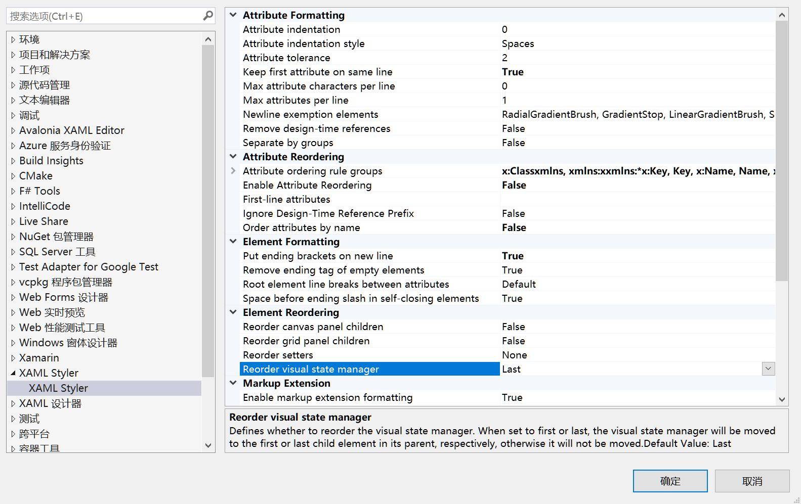

# Avalonia.MusicStore
来自 Avalonia 官方文档：[音乐商店应用](http://git.studylessshape.fun/studylessshape/avalonia-learn-music-store)

官方文档使用 ReactiveUI，个人不是很喜欢这种很重的框架，我尝试使用 CommunityToolkit.Mvvm 并结合 Microsoft.Extensions.DependenctInject 实现。

## 格式化插件
Visual Studio 插件市场中搜索 `XAML Styler`（[link](https://marketplace.visualstudio.com/items?itemName=TeamXavalon.XAMLStyler2022)），可以在保存时格式化 XML，挺好用的。

我的配置参考如下：



主要修改了下面几个地方：

1. `Keep first attribute on same line`：保证第一个属性在同一行；
2. `Enable Atrribute Reordering`：属性排序；
3. `Put ending brackets on new line`：将结束括号放在新行（可以不能控制是否是自闭型）。

## 部分需要理解的点
官方文档中有部分看着无来由，也没有详细解释的点，学习时我将记录在下面。

### 1. 窗口样式（[link](https://docs.avaloniaui.net/zh-Hans/docs/tutorials/music-store-app/creating-a-modern-looking-window)）
#### TransparencyLevelHint
这个会令我比较疑惑，其中的值从何而来。

看到源码 [WindowTransparencyLevel.cs#L33](https://github.com/AvaloniaUI/Avalonia/blob/master/src/Avalonia.Controls/WindowTransparencyLevel.cs#L33)，这里理论上应该是将其默认具有的几种透明方式注入了，但是插件的代码提示中并没有。

`AcrylicBlur` 即是 33 行定义的一个字段。

#### 亚克力模糊效果中 `Panel` 应该在哪里设置
注意到我的项目结构和官方的不一致。

因为我创建是直接创建的跨平台项目，所以在桌面端，使用的是 `MainWindow`，网页端估计是 `MainView`，手机端可能也是 `MainView`。

而 `MainWindow` 中的内容部分，是直接使用了 `MainView`，所以出了需要直接设置到 `MainWindow` 的地方，其他的都可以在 `MainView` 中设置。

### 4. 打开对话框
这里教程就开始使用 Reactive UI 了。

#### 注册服务
那么为了实现复杂的功能，首先是把所有的 View 和 ViewModel 都作为服务注册到了 ServiceCollection 中。

```csharp
internal static IServiceCollection RegistViewSerivces(this IServiceCollection services)
{
    #region Views
    services.AddSingleton<MainView>();
    services.AddSingleton<MainWindow>();

    services.AddTransient<MusicStoreView>();
    services.AddTransient<MusicStoreWindow>();
    #endregion

    #region ViewModels
    services.AddSingleton<MainViewModel>();
    services.AddTransient<MusicStoreViewModel>();
    #endregion

    return services;
}
```

注意到这里将 `MainView` 以及 `MainWindow` 注册为了单例，这部分考虑的是主界面和主窗口都作为其他所有界面和窗口的基础，并且生命周期跟随程序的开启和关闭。

作为对话框使用的 `MusicStoreView` 及 `MusicStoreWindow`，则是注册成了临时服务，在关闭时会被释放掉。这样在下一次再请求该窗口时，会生成一个新的窗口。

#### 使用依赖注入
依赖注入的使用很简单，在构造函数的参数中，添加需要的服务即可。

`MainWindow` 的设计 XML 中，我直接将其中的 `<view:MainView` 删掉了，改为依赖注入的形式添加。并且因为没有无参构造函数函数，会导致 Avalonia 的设计器无法渲染预览结果，所以需要添加一个无参构造函数。修改完成的代码如下：

```csharp
public partial class MainWindow : Window
{
    private readonly IServiceProvider _serviceProvider;

#if DEBUG
    public MainWindow()
    {
        InitializeComponent();
    }
#endif

    public MainWindow(MainView mainView, IServiceProvider serviceProvider)
    {
        this.Content = mainView;
        this._serviceProvider = serviceProvider;

        InitializeComponent();
    }
}
```

`MainView` 也是同样的道理。

```csharp
public partial class MainView : UserControl
{
#if DEBUG
    public MainView()
    {
        InitializeComponent();
    }
#endif

    public MainView(MainViewModel mainViewModel)
    {
        this.DataContext = mainViewModel;

        InitializeComponent();
    }
}
```

#### 事件注册
下一步是打开对话框，Reactive UI 自带的一些内容，可以使得注册事件比较灵活。

这里就直接使用 C# 的 `event` 来注册事件了。

打开对话框需要有一个父级窗口，`MusicStoreWindow` 的父级窗口在这个项目中为 `MainWindow`。而打开对话框的按钮的 Command，是在 `MainViewModel` 中实现的。

所以，为了打开对话框，首先需要考虑如何获取到 `MainWindow`。

有这么几种方式。

1. 通过 `App.Current.MainWindow` 获取；
2. 在构造时，将 `MainWindow` 传给 `MainViewModel`；
3. 在 `MainViewModel` 中添加点击事件，然后在 `MainWindow` 中编写打开对话框的方法，并注册到事件中。

1 方法的弊端在于，这个项目是 `MainWindow` 为父级，同时 `App.Current.MainWindow` 也是 `MainWindow`，但是如果父级不为 `App.Current.MainWindow` 时，就失效了。

2 方法在于会造成交叉引用，并且不能将 `MainWindow` 写在构造函数中，不然会导致依赖注入失败。

所以比较好的还是 3 方法。

在 `MainViewModel` 中声明这个事件：

```csharp
public event Func<Task<AlbumViewModel?>>? GetAlbumEvent;
```

因为需要异步等待，所以返回值包了一层 `Task`。

然后在 `MainWindow` 中实现打开对话框的函数，并注册：

```csharp
public partial class MainWindow : Window
{
    private readonly IServiceProvider _serviceProvider;

#if DEBUG
    public MainWindow()
    {
        InitializeComponent();
    }
#endif

    public MainWindow(MainView mainView, IServiceProvider serviceProvider)
    {
        this.Content = mainView;
        this._serviceProvider = serviceProvider;
        // add
        var mainViewModel = _serviceProvider.GetService<MainViewModel>();
        if (mainViewModel != null)
        {
            mainViewModel.GetAlbumEvent += DoShowDialog;
        }

        InitializeComponent();
    }
    // add
    private async Task<AlbumViewModel?> DoShowDialog()
    {
        var storeWindow = _serviceProvider.GetService<MusicStoreWindow>();

        if (storeWindow is null)
        {
            return null;
        }

        return await storeWindow.ShowDialog<AlbumViewModel?>(this);
    }
}
```

使用服务拿 `ViewModel` 其实和直接强转 `mainView` 的 `DataContext` 一样。不过在注册服务时，`MainViewModel` 是单例，所以直接从服务中拿即可。

最后，在按钮的 Command 方法中调用即可。

```csharp
public partial class MainViewModel : ViewModelBase
{
    public event Func<Task<AlbumViewModel?>>? GetAlbumEvent;

    [RelayCommand]
    private async void BuyMusic()
    {
        var album = await GetAlbumEvent?.Invoke()!;
    }
}
```

### 7. 专辑视图
这里的 `ViewLocator.cs` 是生成 MVVM 项目时项目模板中包含的。

这里直接复制过来了。

- [ViewLocator.cs](./Avalonia.MusicStore/ViewLocator.cs)